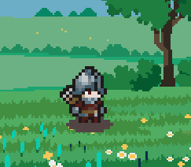
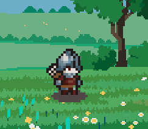
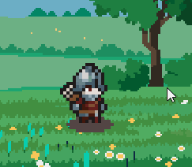

# Devlog #03 — Real Player Movement & Camera System

## What I worked on
Last devlog ended with the player being a complete illusion — standing still while the background faked movement. Today that got fixed properly. Built a real `Camera` class using `sf::View`, restructured how `Engine`, `World`, `Player` and `Camera` talk to each other, and got genuine player movement working across the world. Infinite background scrolling is still in the backlog.

## What I implemented
**Camera System**</br>
Built a proper `Camera` class wrapping `sf::View`. Takes a `RenderWindow` reference and resolution at construction. Exposes a `Move()` method so `Player` can push the view along with it. `World` owns the camera and applies the view every frame at the end of `Update()`.

**Real Player Movement**</br>
Removed the fake background-moves-instead-of-player trick. `Player` now actually moves across the world using `sf::Sprite::move()` and simultaneously moves the camera by the same vector. Background layers still move independently but at fractional speeds for the parallax depth effect.

**Parallax Speed Tuning**</br>
Each background layer now moves at a fraction of player speed instead of arbitrary values, so depth feels consistent regardless of player speed changes later:
```
sky      → playerSpeed * 0.1
clouds   → playerSpeed * 0.5
ground   → playerSpeed * 0.75
trees    → playerSpeed * 1.0
```

## Problems I ran into
Today i ran into many problems. Here's all
**Window not valid when World and Camera constructed**</br>
`_window` was being assigned in the constructor body but `_world` and `_camera` were already constructed before that line ran, receiving an empty invalid window.

**Background layers lagging then snapping to catch up**</br>
Expected smooth parallax. Instead layers appeared to delay a few frames then snap forward to catch up with the camera.

**Game crashing immediately on startup**</br>
Window flashed and closed. No error message. Traced back to Background objects loading textures before the OpenGL context existed.

## How I solved them
**Window not valid when World and Camera constructed**</br>
Members construct in declaration order before the constructor body runs. `_window` needs to be in the initializer list so it's ready before `_world` and `_camera` receive it:

```cpp
Engine::Engine(unsigned int width, unsigned int height, const std::string& title)
    : _window(sf::VideoMode({width, height}), title),
      _world(_inputHandler, _window) { }
```

**Background layers lagging then snapping**</br>
Update order was wrong. Camera view was being applied before player moved, creating a one frame desync that compounded visually. Fix was applying the view last after everything else moved:

```cpp
void World::Update(const float& deltaTime) {
    _inputHandler.Update(_window);
    _player.Update(deltaTime, _inputHandler, _camera);
    _background.Update(deltaTime, _inputHandler.GetAxis());
    _camera.Update(deltaTime); // apply view last
}
```

**Crash on startup**</br>
`sf::Texture::loadFromFile()` uploads to the GPU and needs an OpenGL context which only exists after `RenderWindow` is created. `Background` objects were globals so they constructed before `main()` ran. Fixed by moving them inside `ParallaxBackground` as proper class members.

What made everything work is calling the constructors correctly. also in `World` class, in the constructor for other
classes, i used `_window`, which crashed the game everytime, but the problem was solved
when i passed `window` i got from constructor of `World()`

## What's next
- Infinite background layer scrolling

<!-- ## Screenshots / GIFs


*Idle Animation*



*Walking Animation*



*Attack Animation* -->
